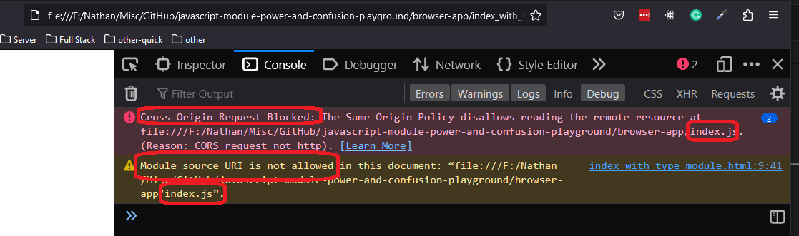

<h2>Motivation</h2>
experiment with js module problems and solution

<h2>import using script tag</h2>
<h4>Files</h4>
<ul>
<li>index_without_type_modole.html : import error</li>
<li>index_without_type_module.html : import ok . because we use type='module' in the script element. type='module' direct the browser to use es modules</li>
</ul>
</li>
<h4>Points of interests</h4>
<ul>
<li>load these html with live server or any other server otherwise you will get an error </li>
<li>the error that you get is related to the index.js file.If the html is loaded from a server you trust ,you can also trust loaded index.js. But, if the html is not loaded from the server you might not want to trust this index.js - so you get the error. 

</li>
</ul>